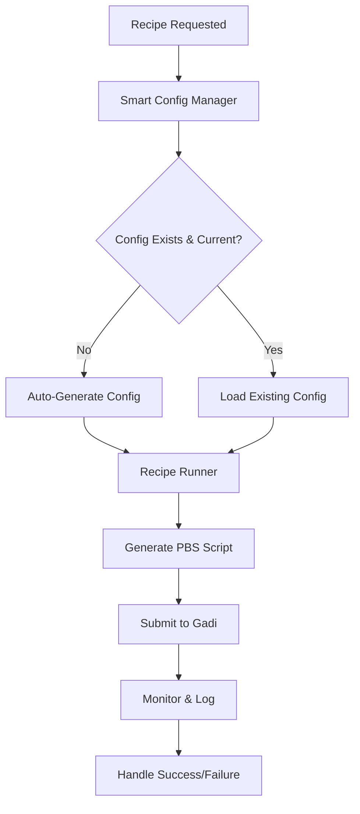

# Smart Recipe Runner

🧠 **Intelligent ESMValTool recipe execution with automatic configuration management and HPC integration**

This unified GitHub Action replaces both the `deploy-recipe-cicd` and `run-recipe` actions, providing a self-managing, intelligent system for ESMValTool recipe execution.

## ✨ Key Features

- 🔄 **Self-Healing Configuration**: Automatically detects and regenerates configuration when recipes change
- 🧠 **Intelligent Resource Detection**: Analyzes recipes to determine optimal resource requirements
- 🎯 **Smart Execution**: Skips unnecessary runs and provides fallback configurations
- 🖥️ **HPC Integration**: Full PBS integration with Gadi and other HPC systems
- 📊 **Multiple Execution Modes**: Run-only, setup-and-run, config-check, and dry-run modes
- � **Batch Processing**: Matrix strategy for parallel execution of multiple recipes
- 🔍 **Recipe Discovery**: Automatic discovery and filtering of available recipes
- �🛡️ **Robust Error Handling**: Comprehensive failure detection and GitHub issue management
- 🔄 **Version Management**: Support for multiple ESMValTool versions

## 🚀 Usage

### Single Recipe Execution

```yaml
- name: Run Recipe
  uses: ACCESS-NRI/smart-recipe-runner@v1
  with:
    recipe: recipe_example
    esmvaltool_version: main
```

### Multiple Recipe Execution (Matrix Strategy)

```yaml
# Setup job - generates execution matrix
setup:
  outputs:
    matrix: ${{ steps.generate-matrix.outputs.matrix }}
  steps:
    - uses: ACCESS-NRI/smart-recipe-runner@v1
      id: generate-matrix
      with:
        recipe: all  # Special value for matrix generation
        generate_matrix: true
        recipe_filter: "recipe_.*"  # Filter recipes by pattern
        resource_filter: "all"     # or "small", "medium", "large"

# Execute job - runs recipes in parallel
execute:
  needs: setup
  strategy:
    matrix: ${{ fromJson(needs.setup.outputs.matrix) }}
  steps:
    - uses: ACCESS-NRI/smart-recipe-runner@v1
      with:
        recipe: ${{ matrix.recipe }}
        mode: run-only  # Configuration already generated
```

### Recipe Filtering Options

```yaml
# Filter by pattern (regex)
recipe_filter: "recipe_(example|test).*"

# Filter by computational requirements
resource_filter: "small"  # small, medium, large, extra-large

# Custom recipe list (comma-separated)
recipe_filter: "recipe_example,recipe_validation,recipe_test"
```

### Advanced Usage

```yaml
- name: Smart Recipe Execution
  uses: ./.github/actions/smart-recipe-runner
  with:
    recipe: recipe_climwip_test_basic
    mode: setup-and-run
    esmvaltool_version: v2.13.0
    conda_module: conda/access-med
    force_config_regeneration: 'true'
    hpc_system: gadi
    project_name: w40
```

### Configuration Check Only

```yaml
- name: Verify Configuration
  uses: ./.github/actions/smart-recipe-runner
  with:
    recipe: recipe_example
    mode: config-check
```

### Dry Run (Testing)

```yaml
- name: Test Recipe Configuration
  uses: ./.github/actions/smart-recipe-runner
  with:
    recipe: recipe_example
    mode: dry-run
```

## 📋 Inputs

| Input | Description | Required | Default |
|-------|-------------|----------|---------|
| `recipe` | Recipe name to run | ✅ | |
| `mode` | Execution mode: `run-only`, `setup-and-run`, `config-check`, `dry-run` | ❌ | `run-only` |
| `esmvaltool_version` | ESMValTool version to use | ❌ | `main` |
| `conda_module` | Conda module to load | ❌ | `conda/access-med` |
| `config_path` | Path to repository configuration file | ❌ | `.github/config/repository-config.yml` |
| `force_config_regeneration` | Force config regeneration | ❌ | `false` |
| `recipe_directory` | Path to recipes directory | ❌ | `admin/ESMValTool/esmvaltool/recipes` |
| `hpc_system` | Target HPC system | ❌ | `gadi` |
| `project_name` | HPC project allocation | ❌ | `w40` |
| `storage_paths` | HPC storage paths (comma-separated) | ❌ | `gdata/kj13,gdata/fs38,...` |

## 📤 Outputs

| Output | Description |
|--------|-------------|
| `status` | Recipe execution status (`success`, `failed`, `skipped`, `config-updated`) |
| `job_id` | PBS job ID if submitted |
| `log_url` | URL to log artifact |
| `config_status` | Configuration management status |
| `resource_group` | Detected resource group for recipe |

## 🎛️ Execution Modes

### `run-only` (Default)
- Checks configuration validity
- Auto-regenerates if needed
- Executes recipe
- Standard production mode

### `setup-and-run`
- Forces configuration regeneration
- Executes recipe
- Use when recipes have changed significantly

### `config-check`
- Only validates/regenerates configuration
- Does not execute recipe
- Useful for configuration testing

### `dry-run`
- Generates PBS script but doesn't submit
- Shows what would be executed
- Perfect for testing and debugging

## 🧠 Intelligence Features

### Automatic Resource Detection

The action analyzes recipes using multiple heuristics:

- **Known Recipe Database**: Maintains classifications from historical analysis
- **Content Analysis**: Examines YAML structure for complexity indicators
- **Heuristic Scoring**: Uses keywords and patterns to estimate resource needs

### Resource Groups

| Group | Queue | Memory | Walltime | Use Case |
|-------|-------|--------|----------|----------|
| `light` | `copyq` | 32GB | 2:00:00 | Simple diagnostics |
| `medium` | `normal` | 64GB | 4:00:00 | Standard recipes |
| `heavy` | `normal` | 128GB | 8:00:00 | Complex multi-model |
| `megamem` | `megamem` | 1000GB | 8:00:00 | Memory-intensive |

### Smart Configuration Management

- **Change Detection**: Uses content hashing to detect recipe changes
- **Incremental Updates**: Only regenerates when necessary
- **Fallback Logic**: Works even without configuration files
- **Cache Optimization**: Avoids redundant analysis

## 🔧 Environment Requirements

Required environment variables:

```yaml
env:
  GADI_USER: ${{ secrets.GADI_USER }}
  GADI_KEY: ${{ secrets.DEPLOY_KEY }}
  SCRIPTS_DIR: ${{ secrets.GADI_SCRIPTS_DIR }}
  GITHUB_TOKEN: ${{ secrets.GITHUB_TOKEN }}
```

## 🏗️ Architecture

```
smart-recipe-runner/
├── action.yml              # Main action definition
├── lib/
│   ├── config-manager.py   # Intelligent configuration management
│   ├── recipe-runner.py    # HPC execution logic
│   └── resource-detector.py # (Future: ML-based resource prediction)
└── README.md              # This file
```

### Workflow Integration



## 🐛 Troubleshooting

### Configuration Issues

If recipes aren't found in configuration:
- Action automatically falls back to heuristic-based detection
- Use `force_config_regeneration: 'true'` to rebuild config
- Check `config_status` output for details

### Job Submission Failures

Common issues:
- Check `GADI_USER`, `GADI_KEY`, `SCRIPTS_DIR` environment variables
- Verify HPC project allocation and quotas
- Review PBS script in dry-run mode

### Resource Misallocation

If recipes are assigned wrong resources:
- Update known recipe classifications in `config-manager.py`
- Use `mode: setup-and-run` to force re-analysis
- Submit feedback via GitHub issues

## 🤝 Contributing

To enhance the intelligence:

1. **Add Recipe Classifications**: Update `known_heavy_recipes` and `known_megamem_recipes` sets
2. **Improve Heuristics**: Enhance `analyze_recipe_complexity()` method
3. **Add New Modes**: Extend execution modes for specific use cases

## 📈 Benefits Over Previous System

| Aspect | Old System | Smart Runner | Improvement |
|--------|------------|--------------|-------------|
| **Actions to Maintain** | 2 separate actions | 1 unified action | 50% reduction |
| **Configuration** | Manual deployment required | Automatic detection | Self-healing |
| **Resource Detection** | Static configuration | Dynamic analysis | Adaptive |
| **Error Recovery** | Manual intervention | Automatic fallbacks | Resilient |
| **Testing** | Complex setup | Built-in dry-run | Developer-friendly |

## 🎯 Future Enhancements

- **ML-Based Resource Prediction**: Learn from execution history
- **Cross-HPC Support**: Extend beyond Gadi to other systems
- **Advanced Caching**: Recipe-level execution caching
- **Performance Analytics**: Resource utilization optimization
